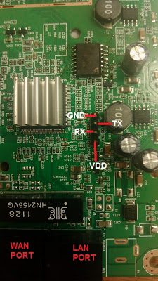
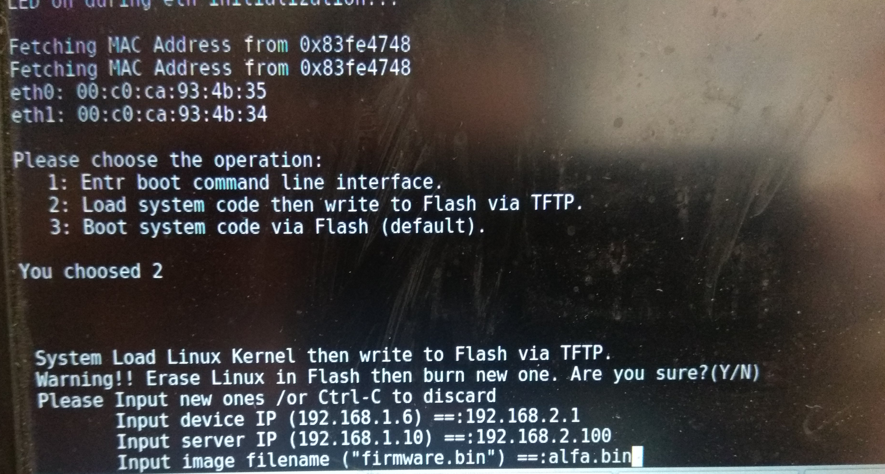
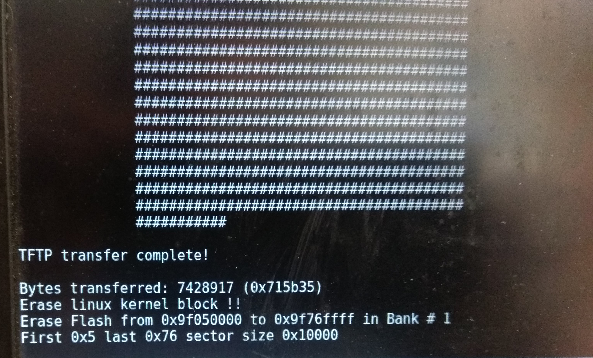

# HOWTO INSTALL OPENWRT ON ALFA N5
The alfa N5 is an outdoor router supporting [OpenWRT](https://openwrt.org) and its mesh improvements [qmp](https://qmp.cat) and [libremesh](https://libremesh.org).

This router has proven its robustness in guifi.net mesh networks, while alfa, a hardware manufacturer from Taiwan, has proven itself to be more *open source friendly* and *GPL respectful* then better known manufacturers like Ubiquity (an infamous GPL violator). The alfa N5 can be used as an alternative to the Ubiquity Nanostation, though with less transmission power (14db the alfa N5 , 802.11n / tipically 16db the Nanostation, 802.11ac in newer versions). Its price in Europe, as of april 2018, is about 75.- euros, taxes included.

[OpenWRT alfa N5 datasheet](https://openwrt.org/toh/hwdata/alfanetwork/alfanetwork_n5)

However, the installation process does not support a *click one button* option, so here are instructions about how to install OpenWRT on the alfa N5.

### What you need

#### Hardware
- serial-to-USB cable
- philips (cross) screwdriver to disassemble the alfa N5
- two ethernet cables

#### Software
- a GNU/Linux computer with the programs `screen` and `dnsmasq` installed
- the latest image of OpenWRT for alfa n5 - [stable (17.01.4 as of april 2018)](https://downloads.lede-project.org/releases/17.01.4/targets/ar71xx/generic/lede-17.01.4-ar71xx-generic-alfa-nx-squashfs-factory.bin) or [development](https://downloads.openwrt.org/snapshots/targets/ar71xx/generic/openwrt-ar71xx-generic-alfa-nx-squashfs-factory.bin), **renamed to `/tmp/alfa.bin`** for practicity!

#### Scripts
- make a new file called loader.sh, containing these lines (thanks to [Dyangol](https://github.com/dyangol) for the inspiration)
```
#/bin/bash
USER=`whoami`
ip a a 192.168.2.100/24 dev $1
dnsmasq -i $1 --dhcp-range=192.168.2.101,192.168.2.200 \
--enable-tftp --tftp-root=/tmp/ -d -u $USER -p0 -K --log-dhcp --bootp-dynamic
```
- adjust permissions for this newly created file with `chmod a+x loader.sh`

Please note:
1. *If you do not run this script as user `root`, you'll have to assign manually the `192.168.2.100/24` IP address to your localhost.*
2. *The alfa N5 has a default address of 192.168.2.1 at boot.*
3. *Substitute `/tmp/`in the script with the directory where you downloaded the .bin image of OpenWRT for alfa N5.*

### Install
- Connect the serial-to-USB cable to an USB port on your computer and to the disassembled alfa N5 on the serial side.



- Start `screen` as user `root` on your computer in serial mode:

`screen /dev/ttyUSB0 115200`

Note: /dev/ttyUSB0 is the standard USB serial tty on debian, but yours could be a different /dev/ device, find it out with `dmesg` right after plugging the serial-to-USB cable into your USB port!

- Connect an ethernet cable to your computers ethernet port and to the `lan` port of the POE (PowerOverEthernet) adapter.

- Start the `loader.sh` script on your computer, specifying your computer's Ethernet port (*use `ip` or `ifconfig` to find it out, I'll use `enp2s0` in this example*).

`sh loader.sh enp2s0`

- Connect an ethernet cable to the POE (PowerOverEthernet) port of the POE adapter and to the LAN port of the alfa N5 itself. This will give electricity to the router and turn it on.

- *In your opened `screen` session in your computer*, quickly press the button "2" to interrupt the alfa N5 boot process.

- `Input device IP` = `192.168.2.1`
- `Input server IP` = `192.168.2.100`
- `Input image filename` = `alfa.bin`

 

- If the transfer has been succesful, you'll see something similar to this in your `screen` session:



- Once the OpenWRT file (*in this case `alfa.bin`*) has been transferred, **do not disconnect the POE ethernet cable**, wait instead for the alfa N5 to reboot itself automatically.

### Connect to OpenWRT
- Disconnect the serial-to-USB cable, and connect a second ethernet cable to your computer and to the LAN port of the POE adapter.
- Disconnect the first ethernet cable from the LAN port of the alfa N5 and connect it to the WAN/LAN port
- Wait for the alfa N5 to boot and, on your computer, run `dhclient` to connect to it (*A freshly installed OpenWRT always responds at 192.168.1.1, while qmp will respond at 172.30.22.1*) 

